# Find the matching pair

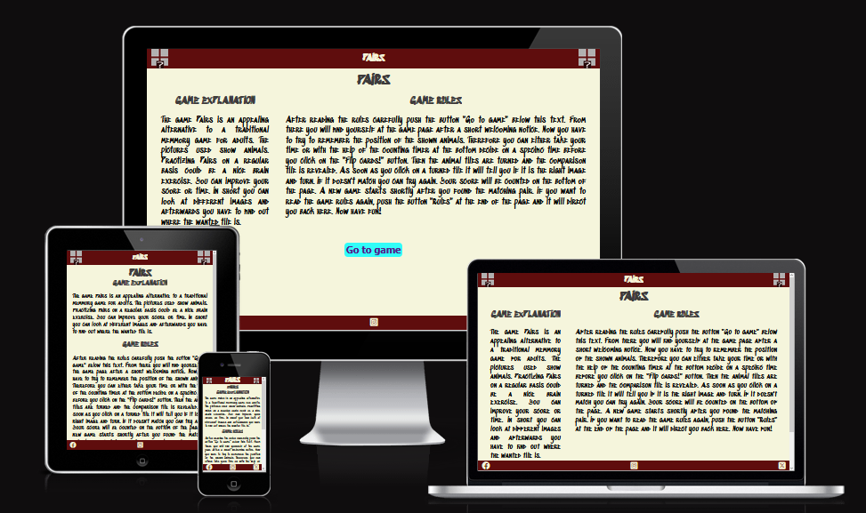
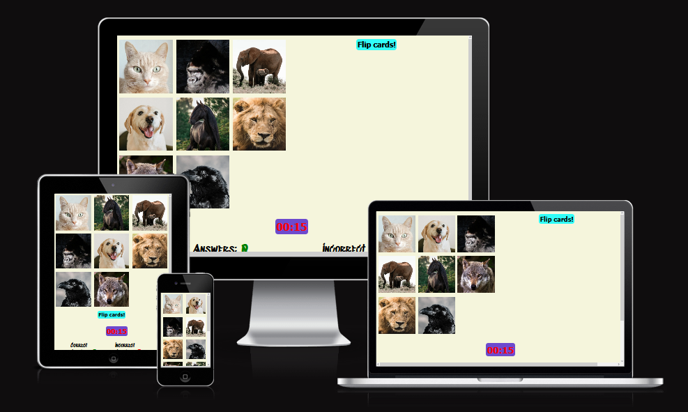

Being interested in different memmory challenges, this JavaScript game should 
be a little challange for the brain. The game should test the visual
memory of the user, while hopefully having fun.

View the live project here: <https://renaschott.github.io/Project2-JSGame/>

## Table of content

- [Find the matching pair](#find-the-matching-pair)
  - [Table of content](#table-of-content)
  - [UX](#ux)
    - [Site goals](#site-goals)
    - [User stories](#user-stories)
      - [As a visitor](#as-a-visitor)
      - [As the administrator](#as-the-administrator)
    - [Wireframes](#wireframes)
    - [Flow Chart](#flow-chart)
  - [Features](#features)
    - [Features left to implement](#features-left-to-implement)
  - [Used Technologies](#used-technologies)
    - [Languages Used](#languages-used)
    - [Framework, Libraries and Programs](#framework-libraries-and-programs)
  - [Testing](#testing)
    - [Validator testing](#validator-testing)
    - [Unfixed bugs](#unfixed-bugs)
  - [Deployment](#deployment)
  - [Credits](#credits)
    - [Content](#content)
    - [Media](#media)
  - [Acknowledgements](#acknowledgements)

## UX

### Site goals

The site wants to challenge the user in different ways using this pairing game.

### User stories

#### As a visitor

- I want to find the rules of the game easily
- I want to be able to get better
- I want to play a fun game
- I want to keep track of the score
- I want to be able to practice
- I want to improve my score
- I want to be entertained

#### As the administrator

- I want to be able to adjust the game if needed
- I want to be able to expand the game
- I want to be able to easily add new option to the game
- I want to be able to easily add new features to the existing game
- I want to be able to make visual adjustments

### Wireframes

Here are the drawings of the wireframes:

### Flow Chart

Here is the previously outlined flow chart:

### Method

#### POC (prove fo concept)

- Display cards all front
- Flip all cards back
- Display one question
- Process user click
- Flip the selected card front
- Check if the card is correct
- Display feedback, selection is right or wrong

#### MVP (minimum viable product)

- Proper start screen
- Continue until the card is found
- End of the game conditions; check all cards
- Proper end screen
- Styling

## Features

### Index page

- **Header**

  - The header includes the name of the game in the middle.
  - On the left and right of the header is the logo of the game displayed.
  - The background color is a dark red.
  - The text color is beige which refers to the background of the main content and matches nicely with the dark background.

- **Footer**

  - The footer shows all necessary social media icons.
  - The icons for facebook, X and Instagram are clickable and open in a new tab.
  - The footer section tries to give options for the users to stay informned about the game.
  - The footer has the same background color as the header.
  - The icons are beige for the same reasons as the text in the header.

- **Main**

  - On a beige background the game in named and the general game idea as well as the game rules are explained.
  - The text color is a dark grey with matches nicely the playful font and the beige background color.
  - The needed "Go to game" button stands out with his light blue background color and brings the user to the game page when clicked.

### Game page

- **Main**

  - The beige background color is the same as for the landing page.
  - For normal text the playful font was also used.

- **Welcome notice**

  - This alert welcomes the user as soon as the game page is loaded.

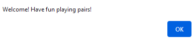

- **Images**

  - Eight animal images are randomly displayed in a grid.
  - The make a nice contrast to the background color.
  - For the game the user needs to remember the place of each specific animal in this grid.

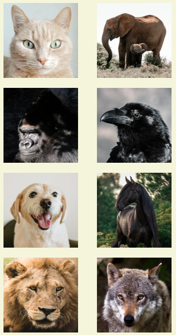

- **Flip Cards! - Button**

  - All buttons are styled the same way (Light blue background and a straight forward font) for better visibility.
  - After looking at the eight displayed images the user needs to push this button for the game to continue.

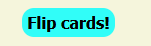

- **Timer**

  - For better visibility is uses the same font as the buttons but the background color is purple and the font color is red.
  - This makes it easy to distinguish it from other features.
  - The timer starts counting as soon as the game starts.
  - It helps the user to see how much time the user needed to remember all cards.

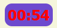

- **Flipped cards**

  - As soon as the "Flip cards" - Button is clicked all eight cards flip simultaniuosly.
  - They reveal a similar background.
  - These card backs have a dark yellow background and a highlighted red question mark on it.
  - These colors match the main background and are contemporaneous not as outstanding as the front cards.

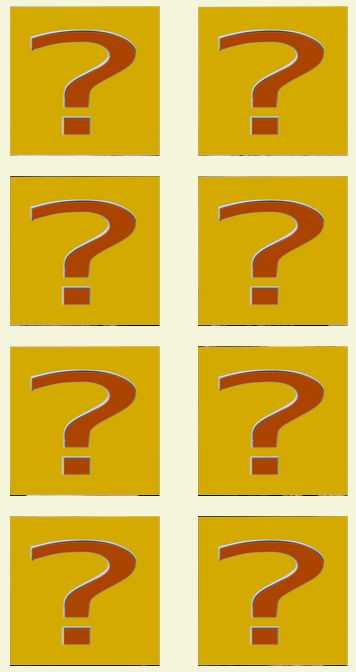

- **Comparison image**

  - As soon as the "Flip cards" - Button is clicked a large image is displayed.
  - This image is randomly chosen out of the eight original animal images.
  - It serves as comparison image.
  - The user has to find the same original image.

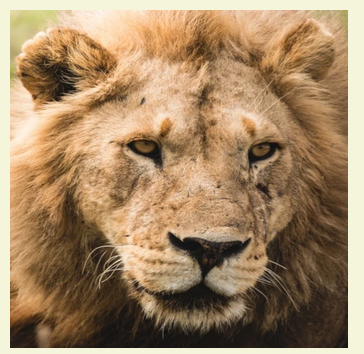

- **Card flip**

  - The user needs to find the original image.
  - By clicking on a card back where the user thinks it is the card is flipped back and evaluated.

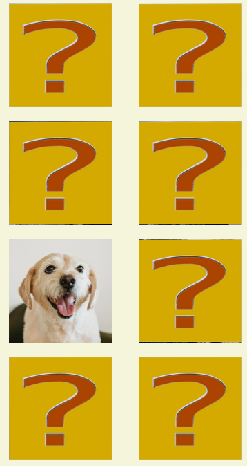

- **User guess evaluation**

  - After the user clicks on a card back the evaluation of the users choice is shown.
  - Is the user guess wrong an appropriate alert displays and the user can try again while the card stays displayed.
  - Is the user guess right another appropriate alert displays congratulating the user and telling the user that after a short delay the game start new. 

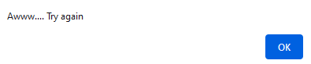
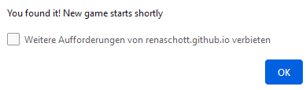

- **Scores**

  - The score area is displayed under the images showing how many tries the user needed to find the original image by counting the correct and incorrect answers.
  - The playful font is used again.
  - The text is displayed in black and for the numbers are typical colors used to highlight their belonging (green for correct answers and red for incorrect answers).

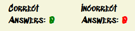

- **Rules Button**

  - If the user needs to review the rules again the user can click on the "Rules" button to return to the landing page.
  - This button is displayed at the end of the page and styled as sll the other buttons to make clear what it is.

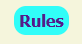

### Features left to implement

There is the possibility to integrate an start screen with more game option
for the users choice as it can be seen below.

- **V2 (version 2)**
  - Timer options
  - Change number of cards
  - Add new comparison types (text, sound)

## Used Technologies

### Languages Used

- HTML
- CSS
- JavaScript

### Framework, Libraries and Programs

- no frameworks and libraries were used
- Balsamiq
  - was used to create the wireframes
- Lucidchart
  - was used to create the flow chart
- Inkscape
  - was used to create the favicon
- GIMP
  - was used to edit the favicon and to edit the images
- Google fonts
  - was used for integrating fonts
- GitHub
  - was used to store and deploy the project site
- Codeanywhere/Gitpod
  - was used to write the code and commit it to GitHub
- Fontawesome
  - was used for the social media icons
- Workversatile
  - was used to convert jQuery code into JS
- Am I responsive
  - was used to check the responsiveness of the website
- DevTools
  - were used to inspect the code during the development process and to check the accessibility
- W3C CSS Validator (Jigsaw)
  - was used to validate the css code
- W3C HTML Validator
  - was used to validate the HTML code
- JSHint, a JavaScript Code Quality Tool
  - was used to validate the JS code
- Languagetool
  - was used to check the spelling and grammar in the README file.
  
## Testing

### Manual testing

- The site was tested on different browsers: Chrome, Firefox and Safari.
- The DevTools confirmed that the page looks good and is functional on different screen sizes.
- I confirmed that the page is readable.
- I confirmed that all buttons, the timer and the click actions work.

| **Feature** | **Expect** | **Action** | **Result** |
|---------------------|--------------------|--------------------------|------------------------------|
| **Go to game - Button** | When clicked the user will be forwarded to the game page | Click "Go to game" - button | The user is forwarded to the game page and the welcoming alert is displayed |
| **Welcoming alert** | When game page is loaded a welcoming alert should show and by clicking ok the game should start | Clicking ok | The wkcoming alert is displayed and the game starts after clicking ok |
| **Flip cards! - Button** | By clicking at the button the eight animal cards should flip and the comparison image should show | Click "Flip cards!" button | The eight images flip revealing the card back and the big comparison image is shown |
| **Timer** | When the game page is loaded the timer should start counting | Clicking ok at the wilcoming alert | The timer starts counting |
| **User guess evaluation** | User clicks on a card back and an alert should tell the user whether it is the right image or not. Is it the corresponding image after a delay the game should start again. Is it the wrong guess the card should flip and the user can guess again | Click on one or more images | The corresponding alert shows and the user continues the game or a new game is started |
| **Scores** | When the user guess right or wrong the corresponding score should be incremented | User clicks on card back | After the evaluation the scores increment | 
| **Rules - Button** | When the user clicks on the "Rules" button the landing page should load | Click on the "Rules" - button | The landing page is shown |

### Testing user stories

| **Expectation - User** | **Result**|
|--------------|------------|
| I want to find the rules of the game easily | The rules are directly displayed on the landing page and the user can return to the landing page whenever needed |
| I want to be able to get better | The user can keep track of the time used and the guesses needed with the help of the timer and the score |
| I want to play a fun game | If it fits the users taste it is a fun game |
| I want to keep track of the score | The score is counted |
| I want to be able to practice | The user can play as many rounds as the user wants |
| I want to improve my score | The score is displayed |
| I want to be entertained | If it fits the users taste it is an entertaining game |

#### As the administrator

| **Expectation - Administrator** | **Result**|
|--------------|------------|
| I want to be able to adjust the game if needed | The code is commented and structured |
| I want to be able to expand the game | The code is commented and structured |
| I want to be able to easily add new option to the game | The code is commented and structured |
| I want to be able to easily add new features to the existing game | The code is commented and structured |
| I want to be able to make visual adjustments | The code is commented and structured |

### Validator testing

- **HTML**

  - Landing page
    - Error

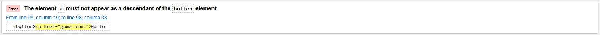

    - Warning

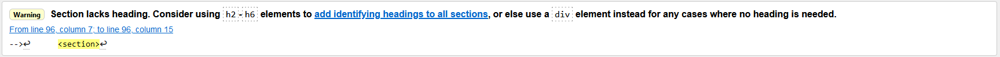  

  - Game page
    - Errors

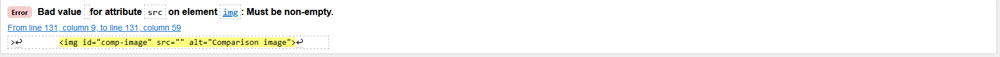
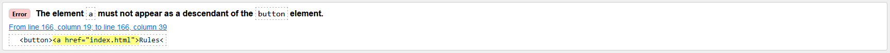

    - Warnings

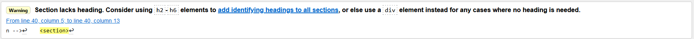
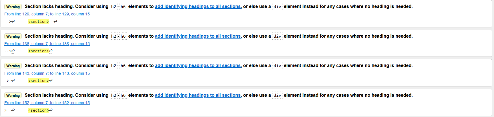
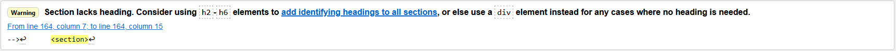

- **CSS**

  - No errors were found

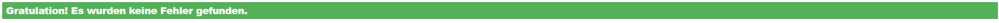

- **JavaScript**
  
  - Errors
    - No errors were found
  
  - Warnings

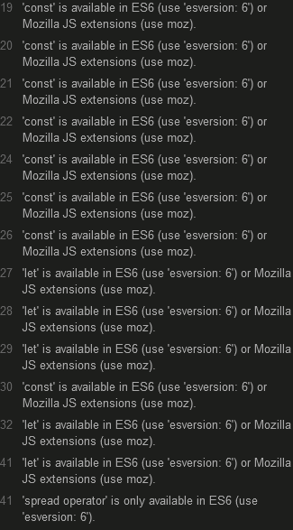
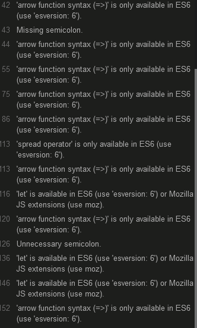

- **Accessibility**

  -

### Unfixed bugs

- The described HTML error of the landing page was kept since it did not effect the function. The warning is acceptable.
- The described HTML errors of the game page were kept since it did not effect the function. The warnings are acceptable.
- The JS warnings are acceptable.

## Deployment

The deployment was done using <https://github.com/>

- For this, the following steps were used:
  - Open the appropriate GitHub repository
  - Click on the Settings tab in the navigation
  - Open Pages in the dropdown menu
  - Do the following steps in the Build and deployment section
    - Select "deploy from branch" in source
    - Select "main" in select branch
    - Select "/(root)" in select folder
    - Finally push the save button
  - From now onwards the deployed site can be visited using the link provided on top of the page

The link to the live page can be found here: [JSGame] (<https://renaschott.github.io/Project2-JSGame/>)

## Credits

### Content

The content of this project was inspired by the Love Math project and the content of the course. In general the following websites where used for inspiration:
  - <https://www.markdownguide.org>
  - <https://developer.mozilla.org>
  - <https://www.w3schools.com/>
Inspirations for specific problems where taken from the following websites:
  - <https://jsbin.com/gazusipeta/1/edit?html,css,js,output>
  - <https://jsbin.com/deqejekomu/edit?html,css,js,output>
  - <https://www.educative.io/answers/how-to-ensure-an-event-listener-is-only-fired-once-in-javascript>
  - <https://openjavascript.info/2022/12/11/random-image-with-javascript/>
  - <https://www.tutorialspoint.com/how-to-show-images-with-a-click-in-javascript-using-html>
  - <https://codepen.io/DevelopedByKieran/pen/JjwKbpO>
  - <https://codepen.io/mondal10/pen/WNNEvjV>
  - <https://www.freecodecamp.org/news/refresh-the-page-in-javascript-js-reload-window-tutorial/>
  - <https://stackoverflow.com/questions/37604456/how-to-make-a-div-flip-on-button-press>

### Media

The animal images for the game page were taken from <https://www.pexels.com>.
The social media icons were taken from <https://fontawesome.com/>.
The generic 404 page from project 1 was reused here.

## Acknowledgements

- I thank would love to thank the following persons:
  - My mentor for his support
  - The Code Institute tutor support for their fast answers
  - My facilitator for her support
  - The slack community for their fast answers and support
