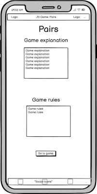
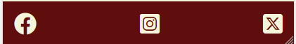

# Find the matching pair

This JavaScript game should be a little challange for the brain. The game should test the visual
memory of the user with different levels of difficulty for the user to choose.

View the live project here: <https://renaschott.github.io/Project2-JSGame/>

## Table of content

- [UX](## UX)
- [Site goals](### Site goals)
- [User stories](### User stories)
- [As a visitor](#as-a-visitor)

## UX

### Site goals

The site wants to challenge the user in different ways using this pairing game.

### User stories

#### As a visitor (#as-a-visitor)

- I want to find the rules of the game easily
- I want to get a fast overview of the possible game options
- I want to adjust different options to my skill level
- I want to be able to get better and adjust the game
- I want to play a fun game
- I want to keep track of the score
- I want to be able to practice
- I want to improve my score
- I want to be entertained

#### As the administrator

- I want to be able to adjust the game if needed
- I want to be able to expand the game
- I want to be able to easily add new option to the game
- I want to be able to easily add new features to the existing game
- I want to be able to make visual adjustments

### Wireframes

Here are the drawings of the wireframes:

### Flow Chart

Here is the previously outlined flow chart:

## Features

- **Header and Navigation**

  - The Header

- **Footer**

  - The footers

- **Index page**

  -

### Features left to implement

## Used Technologies

### Languages Used

- HTML
- CSS
- JavaScript

### Framework, Libraries and Programs

- no frameworks and libraries were used
- Balsamiq
  - was used to create the wireframes
- Lucidchart
  - was used to create the flow chart
- Inkscape
  - was used to create the favicon
- GIMP
  - was used to edit the favicon and to edit the images
- Google fonts
  - was used for integrating fonts
- GitHub
  - was used to store and deploy the project site
- Codeanywhere
  - was used to write the code and commit it to GitHub
- Fontawesome
  - was used for the social media icons
- Am I responsive
  - was used to check the responsiveness of the website
- DevTools
  - were used to inspect the code during the development process and to check the accessibility
- W3C CSS Validator (Jigsaw)
  - was used to validate the css code
- W3C HTML Validator
  - was used to validate the HTML Code
- Languagetool
  - was used to check the spelling and grammar in the README file.
  
## Testing

NOCH ÜBERARBEITEN

- The site was tested on different browsers: Chrome and Firefox.
- The DevTools confirmed that the page looks good and is functional on different screen sizes.
- I confirmed that the page is readable.
- The menu is easy to understand.
- I confirmed the function of the form page.

### Validator testing

- **HTML**
  -
  
- **CSS**
  -

- **Accessibility**

  -

### Unfixed bugs

## Deployment

The deployment was done using <https://github.com/>

- For this, the following steps were used:
  - Open the appropriate GitHub repository
  - Click on the Settings tab in the navigation
  - Open Pages in the dropdown menu
  - Do the following steps in the Build and deployment section
    - Select "deploy from branch" in source
    - Select "main" in select branch
    - Select "/(root)" in select folder
    - Finally push the save button
  - From now onwards the deployed site can be visited using the link provided on top of the page

The link to the live page can be found here: [JSGame] (<https://renaschott.github.io/Project2-JSGame/>)

## Credits

### Content

The content of this project was inspired by the Love Math project, the content of the course
<https://www.markdownguide.org>

### Media

Animal images were taken from <https://www.pexels.com>.
The social media icons were taken from <https://fontawesome.com/>.
The generic 404 page from project 1 was reused here.

## Acknowledgements

- I thank would love to thank the following persons:
  - My mentor for his support
  - The Code Institute tutor support for their fast answers
  - My facilitator for her support
  - The slack community for their fast answers and support
